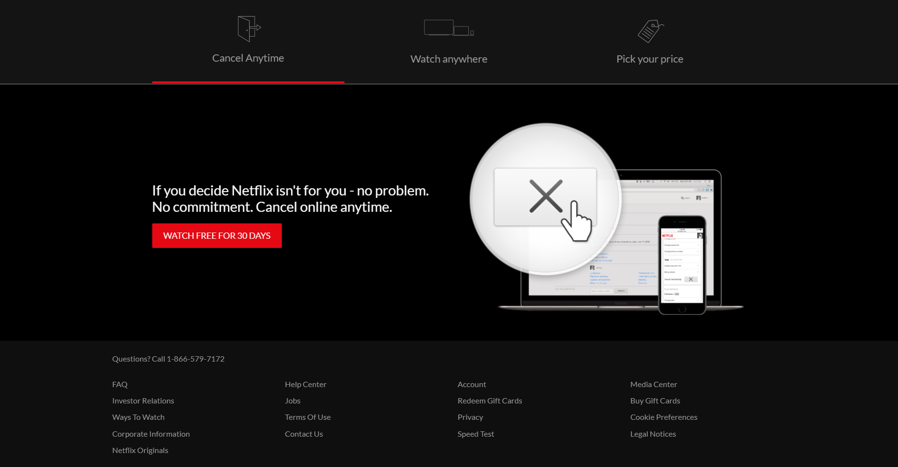

<h1 align="center">Netflix Landing Page Clone🍿🎞️</h1>

 

Hey guys, this is a project that i learned to develop through a youtube video published by the <a href="https://www.youtube.com/channel/UC29ju8bIPH5as8OGnQzwJyA">Traversy media channel</a> where it teaches how to create a clone of the netflix homepage.
The purpose of this project for me is to train my knowledge in HTML, CSS, JS and some puglins with JQUERY.

<h4 align="center">
<a href="https://gustavojuvino.github.io/NetflixClone/">Netflix Clone Website</a></h4>

</img>

</img>
</img>
</img>
</img>
</img>
